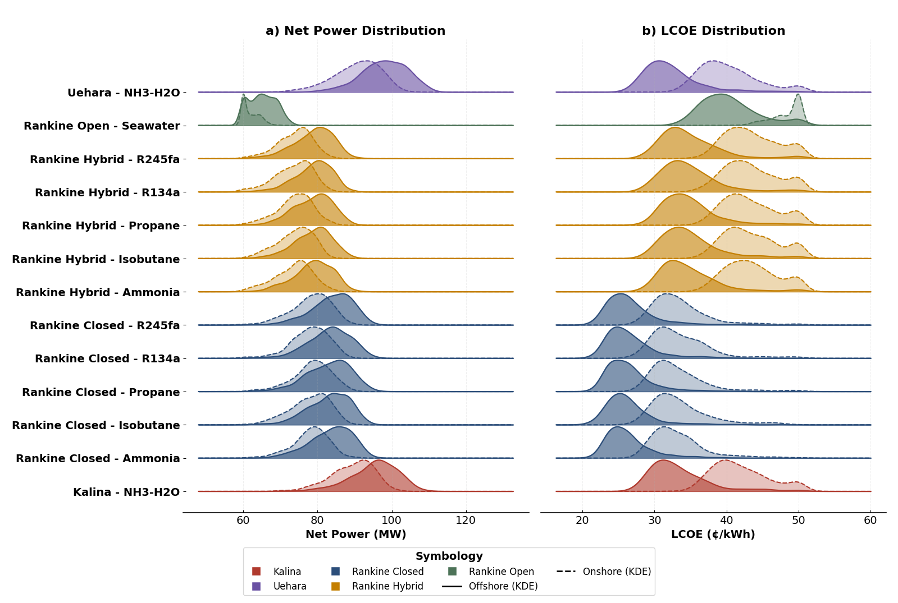

# Summary

Ocean thermal energy conversion (OTEC) offers a unique form of renewable baseload power by exploiting the stable temperature difference between warm surface waters and cold deep ocean waters. Despite its long development history and significant theoretical potential estimated at 300 exajoules per year [@IRENA2014], the advancement of OTEC has been hindered by the lack of accessible, comprehensive, and transparent modeling tools capable of integrating thermodynamic performance, technoeconomic assessment, and resource variability [@Langer2020; @Xiao2023].

This work presents **OTEX**, an open-source Python-based framework developed to address this gap. OTEX provides a unified environment for the design, simulation, and evaluation of OTEC systems, implementing multiple thermodynamic cycle configurations, including closed, open, and hybrid Rankine cycles, as well as Kalina and Uehara cycles with pure and mixed working fluids [@Samsuri2021; @Gonidaki2026]. The framework incorporates detailed heat exchanger modeling, seawater system hydraulics, off-design operation, and long-term oceanographic variability through integration with global reanalysis datasets from the Copernicus Marine Environment Monitoring Service (CMEMS) [@CopernicusMarine2024]. Technoeconomic analysis is performed via component-level cost scaling and levelized cost of electricity (LCOE) metrics, complemented by uncertainty quantification through Monte Carlo simulation and global sensitivity analysis [@Shields2016; @Azzini2021].

By providing a transparent, modular, and extensible modeling platform, OTEX supports reproducible OTEC research, comparative technology assessment, and early-stage project analysis, facilitating systematic exploration of OTEC performance and cost across diverse geographic and design contexts [@SotoCalvo2025; @Nakib2025].

# Statement of need

The global energy landscape stands at a critical juncture. With atmospheric CO₂ concentrations surpassing 420 ppm and global temperatures rising 1.1°C above pre-industrial levels, the imperative for rapid decarbonization has never been more urgent. The International Energy Agency projects that achieving net-zero emissions by 2050 requires renewable energy to constitute approximately 90% of total electricity generation, up from less than 30% today [@IEA2021]. However, this ambitious transition faces a fundamental challenge: the inherent intermittency of dominant renewable sources such as solar and wind energy, which limits their capacity to provide the stable baseload power essential for grid reliability and industrial operations [@Notton2018].

Ocean thermal energy conversion (OTEC) presents a compelling solution to this baseload challenge. Unlike intermittent renewables, OTEC harnesses the temperature differential between warm surface waters (typically 25-28°C) and cold deep ocean waters (typically 4-6°C) to generate continuous, predictable power. This temperature gradient remains remarkably stable throughout day-night cycles and seasonal variations, enabling capacity factors exceeding 90%, comparable to conventional fossil fuel and nuclear plants, and far surpassing the 20-40% typical of solar and wind installations [@Langer2024; @Brecha2021; @VanZwieten2017].

Despite this extraordinary potential and a development history spanning over a century, OTEC has struggled to transition from experimental demonstration to commercial deployment [@Rajagopalan2013; @Wu2014]. Multiple factors have constrained development, including high capital costs estimated at \$50,000-100,000 per installed kilowatt, technical challenges associated with cold-water pipe construction and maintenance, thermodynamic efficiency limitations inherent to the small temperature differential, and insufficient policy support mechanisms to offset these economic barriers during technology maturation [@Langer2020; @Xiao2023].

A significant impediment to OTEC advancement has been the scarcity of comprehensive, accessible modeling tools for system design, performance analysis, and technoeconomic assessment. Existing analytical frameworks have typically been proprietary, limited in scope to specific cycle configurations, or implemented in platforms that restrict accessibility for researchers and developers in resource-constrained settings [@Vera2020; @Hall2022]. General-purpose process simulators (e.g., Aspen Plus, DWSIM) lack specific OTEC modules for oceanographic data integration, cold water pipe hydraulics, and specialized marine heat exchanger sizing [@Nakib2025].

This software gap has hindered:

- Systematic exploration of design space across thermodynamic cycles and working fluids
- Comparative evaluation of cycle architectures under realistic operating conditions
- Sensitivity analysis of key operational and economic parameters
- Rigorous site-specific feasibility studies incorporating actual oceanographic conditions

**OTEX** addresses this critical gap by providing researchers, engineers, and students with the capability to:

1. **Simulate complex thermodynamics:** Handling the non-linear properties of zeotropic mixtures in Kalina and Uehara cycles with vapor-liquid equilibrium calculations [@Gonidaki2026; @Brodal2019; @Gao2025].
2. **Analyze off-design performance:** Modeling how plants behave when seasonal water temperatures deviate from the nominal design point using sliding pressure control strategies [@Langer2024; @Qiao2025].
3. **Integrate real oceanographic data:** Automatic retrieval and processing of spatially and temporally resolved ocean temperature profiles via CMEMS [@CopernicusMarine2024].
4. **Quantify economic risk:** Using built-in statistical tools (Monte Carlo, Sobol indices, tornado diagrams) to assess economic viability under parametric uncertainty [@Shields2016; @Azzini2021; @Zhou2025].
5. **Conduct regional analysis:** Mapping LCOE and power output across geographic domains with site-specific thermal gradients, bathymetry, and distance to shore [@SotoCalvo2025].

The software is written in Python 3.9+ and leverages the scientific Python ecosystem (`NumPy` [@Harris2020], `SciPy` [@Virtanen2020], `Pandas` [@McKinney2010], `Matplotlib`) and utilizes `CoolProp` [@Bell2014] for high-fidelity fluid property calculations when installed.

# State of the field

Previous specific OTEC models in the literature have typically been ad-hoc scripts not released as maintained software packages, limiting reproducibility and community adoption [@Vera2020; @Hall2022; @Bekiloglu2025]. Commercial software tools remain proprietary and expensive, restricting access for academic researchers and developers in emerging economies where OTEC holds greatest promise.

`OTEX` distinguishes itself by being a fully modular, documented, and extensible package available via PyPI (`pip install otex`). The framework uniquely integrates:

* **Multiple thermodynamic cycles:** Closed Rankine with various working fluids (NH₃, R134a, R245fa, propane, isobutane), open Rankine (Claude cycle), hybrid configurations, and advanced binary mixture cycles (Kalina, Uehara) [@Samsuri2021; @Gonidaki2026; @Matsuda2018].
* **Hydraulic modeling:** Explicit calculation of pumping parasitic losses via Darcy-Weisbach formulation, accounting for 30-40% of gross power, with optimized pipe sizing [@Kowalczuk2020].
* **Off-design capabilities:** NTU-effectiveness heat exchanger models with sliding pressure control for annual energy production under real temperature variability [@Langer2024; @Qiao2025].
* **Geospatial analysis:** Regional mapping capabilities demonstrated through case studies in Cuban waters, enabling systematic site selection and resource assessment [@SotoCalvo2025].
* **Uncertainty quantification:** Integrated Monte Carlo simulation with Latin Hypercube Sampling, Sobol global sensitivity indices, and tornado diagrams for local sensitivity screening [@Shields2016; @Azzini2021].

# Technological modeling

OTEX implements a thermodynamic and technoeconomic framework for OTEC system analysis. The software architecture consists of five principal modules: (1) thermodynamic cycle modeling, (2) heat exchanger design and off-design performance, (3) seawater system hydraulics, (4) economic evaluation, and (5) uncertainty quantification. Figure \ref{fig:flowchart} presents the overall computational workflow, systematically evaluating OTEC configurations by combining facility type (onshore/offshore), thermal cycle architecture, and working fluid selection.

## Closed Rankine Cycle

The closed Rankine cycle constitutes the baseline OTEC configuration, employing a low-boiling-point working fluid that undergoes a complete phase-change cycle. The cycle consists of four fundamental processes: (1) evaporation of liquid working fluid via heat absorption from warm seawater at pressure $P_{evap}$, (2) expansion through a turbine extracting mechanical work, (3) condensation to saturated liquid via heat rejection to cold seawater at pressure $P_{cond}$, and (4) compression by a feed pump to complete the cycle.

The evaporation pressure $P_{evap}$ is calculated by imposing the minimum internal temperature approach (MITA) constraint at the evaporator pinch point, which typically occurs at the warm seawater outlet [@Pal2023]:

$$T_{sat}(P_{evap}) = T_{WW,out} + MITA_{evap}$$

Simultaneously, the warm seawater outlet temperature $T_{WW,out}$ is determined from the evaporator energy balance:

$$\dot{m}_{WW} c_{p,sw} (T_{WW,in} - T_{WW,out}) = \dot{m}_{wf} (h_2 - h_1)$$

These equations are solved iteratively via the secant method (typically 3-5 iterations). The condensation pressure follows an analogous formulation:

$$T_{sat}(P_{cond}) = T_{CW,out} - MITA_{cond}$$

$$\dot{m}_{CW} c_{p,sw} (T_{CW,out} - T_{CW,in}) = \dot{m}_{wf} (h_3 - h_4)$$

The turbine expansion (2→3) is modeled with isentropic efficiency $\eta_t$ (typically 0.80-0.88 for OTEC applications):

$$h_3 = h_2 - \eta_t (h_2 - h_{3s})$$

where $h_{3s}$ satisfies the isentropic condition $s_{3s} = s_2$ at pressure $P_{cond}$. For two-phase expansion (when turbine exit quality $0 < x_3 < 1$), thermodynamic properties are computed from phase equilibrium relations. Gross turbine power output is:

$$\dot{W}_t = \dot{m}_{wf} (h_2 - h_3)$$

The feed pump work for incompressible liquid compression is:

$$\dot{W}_p = \frac{\dot{m}_{wf} v_f (P_{evap} - P_{cond})}{\eta_p}$$

where $v_f$ denotes specific volume of saturated liquid and $\eta_p$ is pump isentropic efficiency (typically 0.70-0.80). The cycle thermal efficiency is:

$$\eta_{th} = \frac{\dot{W}_t - \dot{W}_p}{\dot{m}_{wf}(h_2 - h_1)}$$

For OTEC applications with $\Delta T \approx 20°C$, closed Rankine cycle thermal efficiency typically ranges from 2.5% to 4.0%, substantially below the Carnot limit due to finite temperature differences in heat exchangers, component inefficiencies, and working fluid property limitations [@Bekiloglu2025].

## Open and Hybrid Rankine Cycles

The open cycle (Claude cycle) employs warm seawater itself as the working fluid through flash evaporation at sub-atmospheric pressure [@Rajagopalan2013]. This configuration offers inherent simplicity by eliminating the closed working fluid loop and associated heat exchangers. Warm surface seawater is introduced into a flash chamber maintained at reduced pressure $P_{flash}$:

$$P_{flash} = P_{sat}(T_{WW,in} - \Delta T_{NEL})$$

where $\Delta T_{NEL}$ represents non-equilibrium thermal losses (typically 1-2°C) arising from incomplete heat and mass transfer. The mass fraction of seawater vaporized is:

$$x_{flash} = \frac{c_p (T_{WW,in} - \Delta T_{NEL} - T_{sat}(P_{flash}))}{h_{fg}}$$

The hybrid cycle combines closed and open configurations, utilizing a closed ammonia Rankine cycle augmented with flash steam generation from warm seawater [@Wu2014; @Yue2018]. Total power output is:

$$\dot{W}_{hybrid} = \dot{W}_{closed} + \dot{W}_{flash}$$

## Kalina and Uehara Cycles

The Kalina cycle employs ammonia-water (NH₃-H₂O) binary mixtures, exploiting variable boiling temperature during phase change to reduce exergy destruction in heat exchangers [@Gonidaki2026; @Brodal2019]. Mixture enthalpy at temperature $T$, pressure $P$, and ammonia concentration $x$ is computed from:

$$h_{mix}(T, P, x) = x \cdot h_{NH_3}(T,P) + (1-x) \cdot h_{H_2O}(T,P) + h_{ex}(T, P, x)$$

where $h_{ex}$ represents the excess enthalpy of mixing. Phase equilibrium in the separator is governed by equality of component fugacities [@Lemmon2018; @Bell2014]:

$$y_{NH_3} \phi_{NH_3}^V P = x_{NH_3} \gamma_{NH_3} f_{NH_3}^{0,L}$$

$$y_{H_2O} \phi_{H_2O}^V P = x_{H_2O} \gamma_{H_2O} f_{H_2O}^{0,L}$$

where $y_i$ and $x_i$ denote vapor and liquid mole fractions, $\phi_i^V$ are vapor-phase fugacity coefficients, $\gamma_i$ are liquid-phase activity coefficients, and $f_i^{0,L}$ are pure component liquid fugacities.

The Uehara cycle extends the Kalina cycle with absorption heat pump principles, enabling higher thermal efficiency through internal heat recovery [@Gao2025; @Matsuda2018]. The absorber energy balance couples mass and heat transfer:

$$\dot{Q}_{abs} = \dot{m}_{lean}(h_{lean,in} - h_{lean,out}) + \dot{m}_{vapor}(h_{vapor} - h_{condensate})$$

with mass conservation:

$$\dot{m}_{basic} x_{basic} = \dot{m}_{rich} x_{rich} + \dot{m}_{lean} x_{lean}$$

## Off-Design Performance

OTEX implements sliding pressure control for off-design operation [@Langer2024; @Qiao2025]. Under warm-water temperature deficit ($T_{WW} < T_{WW,design}$), the evaporation pressure is reduced proportionally to maintain the MITA constraint:

$$P_{evap,off} = P_{sat}(T_{WW,actual} - \Delta T_{WW} - MITA_{evap})$$

Heat exchanger off-design performance is modeled via the NTU-effectiveness method:

$$NTU = \frac{U \cdot A}{C_{min}}, \quad \varepsilon = f(NTU, C_r, \text{configuration})$$

where the overall heat transfer coefficient $U$ varies with flow regime according to:

$$U \propto Re^n, \quad n \approx 0.8 \text{ (turbulent flow)}$$

Annual energy production is computed across monthly time steps using CMEMS temperature profiles:

$$E_{annual} = \sum_{i=1}^{12} \dot{W}_{net,i} \cdot \Delta t_i$$

The capacity factor is:

$$CF = \frac{E_{annual}}{\dot{W}_{gross,design} \times 8760}$$

## Seawater System Hydraulics

Parasitic power consumption in seawater pumping constitutes 30-40% of gross power output [@Kowalczuk2020]. The total pump power accounts for static head $H$ (depth to cold water intake) and frictional losses $\Delta P_f$:

$$\dot{W}_{pump} = \frac{\dot{m}_{sw}}{\rho_{sw}} \cdot \frac{\rho_{sw} g H + \Delta P_f}{\eta_{pump}}$$

Frictional losses are calculated via the Darcy-Weisbach equation:

$$\Delta P_f = f \frac{L}{D} \frac{\rho_{sw} v^2}{2}$$

where the friction factor $f$ depends on Reynolds number and relative roughness. Net power output is:

$$\dot{W}_{net} = \dot{W}_t - \dot{W}_{p,wf} - \dot{W}_{pump,CW} - \dot{W}_{pump,WW} - \dot{W}_{aux}$$

## Economic Modeling

The levelized cost of electricity (LCOE) serves as the primary economic metric [@Langer2020]:

$$LCOE = \frac{CAPEX \times CRF + C_{\text{OM}}}{E_{\text{annual}}}$$

where the capital recovery factor accounts for discount rate $r$ and project lifetime $n$:

$$CRF = \frac{r(1+r)^n}{(1+r)^n - 1}$$

Capital costs are estimated through component-level scaling relationships [@Adiputra2020; @SotoCalvo2025; @Thirugnana2021]:

$$CAPEX = \sum_j C_{j,ref} \left(\frac{S_j}{S_{j,ref}}\right)^{\alpha_j}$$

with scaling exponents $\alpha_j < 1$ reflecting economies of scale. Major cost elements include the power module (turbine, evaporator, condenser), cold-water pipe, platform/mooring, and grid connection. OTEX provides two cost scenarios: a 'low-cost' baseline assuming technological maturation and manufacturing learning (representative of nth-of-a-kind plants), and a 'high-cost' scenario reflecting current first-of-a-kind economics with substantial risk premiums.

## Uncertainty Quantification

OTEX implements three complementary methodologies: Monte Carlo simulation with Latin Hypercube Sampling (LHS), Sobol global sensitivity analysis, and tornado diagrams [@Shields2016; @Azzini2021; @Zhou2025].

Monte Carlo analysis propagates parametric uncertainties through the complete technoeconomic model. Key uncertain parameters include component efficiencies (turbine, pumps, heat exchangers), cost multipliers, seawater temperature variability, and biofouling factors. Latin Hypercube Sampling ensures efficient coverage of the multidimensional parameter space with sample sizes $N$ typically ranging from 500 to 5000:

$$LCOE_k = f(\mathbf{X}_k), \quad \mathbf{X}_k \sim LHS(\mathbf{X}), \quad k = 1, \ldots, N$$

Sobol indices decompose total output variance into contributions from individual parameters and their interactions. For output $Y$ (e.g., LCOE) as a function of inputs $\mathbf{X} = (X_1, \ldots, X_n)$, the first-order Sobol index $S_i$ measures the variance fraction attributable to $X_i$ alone:

$$S_i = \frac{Var_{X_i}[E_{\mathbf{X}_{\sim i}}(Y | X_i)]}{Var(Y)}$$

Total-order indices $S_{T_i}$ account for both direct effects and all interactions involving $X_i$. Parameters with $S_{T_i} > 0.05$ are deemed influential and warrant focused research or risk mitigation.

Tornado analysis visualizes local sensitivity by independently varying each parameter ±20% from its nominal value while holding others constant. The resulting change in LCOE (or other metric) is ranked to identify dominant drivers.

## Software Architecture

OTEX is implemented in Python 3.9+ leveraging NumPy [@Harris2020] and SciPy [@Virtanen2020] for numerical computations, Pandas [@McKinney2010] for data manipulation, Matplotlib for visualization, and xarray/netCDF4 for oceanographic data processing. Thermodynamic properties are computed via polynomial correlations (for baseline ammonia calculations) or CoolProp [@Bell2014] when installed, providing enhanced accuracy across all working fluids.

The modular architecture separates concerns: thermodynamic cycles (`otex.core`), plant components (`otex.plant`), economic models (`otex.economics`), oceanographic data handling (`otex.data`), and uncertainty analysis (`otex.analysis`). Regional analysis scripts automate the workflow: oceanographic data retrieval from CMEMS, plant optimization across multiple design configurations, LCOE mapping, and capacity factor calculation across spatial domains.

# Functionality demonstration

The capabilities of OTEX are demonstrated through a spatially resolved case study of Cuban waters, evaluating multiple cycle configurations under onshore and offshore scenarios with nominal 100 MW gross power plants. The analysis incorporates CMEMS oceanographic data to account for spatial and temporal temperature variability across the domain.

Figure \ref{fig:kde} summarizes the statistical distributions of net power output and LCOE obtained from all evaluated configurations. Net power distributions are systematically separated by cycle type. Cycles based on ammonia-water mixtures (Kalina and Uehara) exhibit distinctly higher net power output, driven by their superior thermodynamic efficiency stemming from reduced exergy destruction during non-isothermal phase change. Closed Rankine cycles with pure working fluids display more compact distributions with similar central tendencies across ammonia, propane, and isobutane. Open Rankine cycles yield the lowest net power due to inherently low flash fractions and high parasitic consumption in vacuum maintenance.

LCOE distributions are broader and more dispersed than net power, reflecting the combined influence of thermodynamic performance, capital costs, and site-specific factors such as distance to shore and water depth. Closed Rankine cycles exhibit the lowest median LCOE values among all configurations, indicating favorable cost-performance balance for baseline technology. Kalina and Uehara cycles, despite higher net power, incur elevated LCOE due to increased system complexity and heat exchanger area requirements. Hybrid Rankine cycles display wider LCOE distributions driven by combined effects of increased capital cost and moderate gains in net power. Open cycles consistently populate the upper end of the LCOE range.

Figure \ref{fig:pareto} synthesizes aggregated performance metrics by cycle type and working fluid, presenting the median net power-LCOE space with the Pareto frontier formed by nondominated solutions. Points along this frontier represent configurations that maximize net power for a given LCOE or minimize LCOE for a given net power output. The Pareto analysis identifies closed Rankine cycles with isobutane and ammonia as dominant configurations for Cuban waters under the evaluated economic scenario.

Figure \ref{fig:spatial} illustrates the spatial distribution of median net power and LCOE across Cuban waters, comparing Uehara cycle with ammonia-water mixture (offshore) and closed Rankine cycle with isobutane (offshore). Higher net power values are systematically associated with regions where the vertical thermal gradient between surface warm-water and deep cold-water is maximized. LCOE patterns reveal clear spatial coupling between thermodynamic performance and economic outcomes, with regions exhibiting superior thermal resources yielding lower electricity costs. The Uehara configuration achieves lower LCOE values in regions with exceptionally high thermal gradients, while the closed Rankine configuration demonstrates more uniform economic performance across the domain, reflecting its technological maturity and lower capital cost.

# Conclusions

This work introduces OTEX, an open-source, Python-based framework for integrated thermodynamic, technoeconomic, and uncertainty analysis of Ocean Thermal Energy Conversion systems. The tool implements rigorous, physics-based formulations for closed, open, hybrid Rankine, Kalina, and Uehara cycles, coupled with detailed heat exchanger modeling, seawater hydraulics, off-design performance analysis, and direct integration with global oceanographic reanalysis datasets.

The open-source nature of OTEX is central to its intended impact. By making the full codebase, documentation, and example workflows publicly available under the MIT license, OTEX enables transparent, reproducible research and facilitates community-driven improvements. The framework lowers barriers to entry for OTEC research and development, particularly for institutions and developers in resource-constrained settings where OTEC holds greatest promise for energy security and climate resilience.

While the case study presented focuses on Cuban waters, the underlying methodology is fully general and directly applicable to any tropical or subtropical coastal region with access to deep ocean water. Future development priorities include enhanced transient modeling capabilities, integration of desalination and aquaculture co-products, and expanded cost databases reflecting emerging supply chains and manufacturing innovations.

# Figures

# AI usage disclosure

No generative AI tools were used in the development of this software, the writing of this manuscript, or the preparation of supporting materials. Claude Code was employed to write the documentation with human supervision.

# Acknowledgements

We acknowledge the use of data from the Copernicus Marine Environment Monitoring Service (CMEMS). This work supports the advancement of sustainable marine energy planning.

# References
